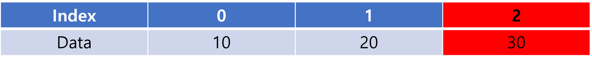

# [자료구조] 1.배열 (Array)
## 특징
- 같은 타입의 데이터를 여러개 나열한 선형 자료구조이다.
- 연속적인 메모리 공간에 순차적으로 데이터를 저장한다.
- 배열은 선언할 때 크기를 정하면, 그 크기로 고정이 된다.

```java
//new 키워드를 사용해서, 배열을 미리 선언하고, 데이터를 넣을 수도 있음
Integer[] data_list = new Integer[3];
data_lsit.add(10);
data_lsit.add(20);
data_lsit.add(30);
```


- 배열은 인덱스를 통해서 요소에 접근할 수 있다.
- 인덱스는 0부터 시작하며, 마지막  인덱스는 배열 요소의 개수 -1 이다.

```java
//size함수를 통해 요소의 개수를 구하여 -1을 하면 마지막을 출력할 수 있다.
data_list.get(data_list.size()-1);
```


## 시간복잡도
- 찾고자 하는 값이 몇 번쨰 인덱스에 있는지 알고 있다면 굉장히 빠른 검색 속도를 갖는다. 배열의 접근은 O(1)의 시간복잡도를 갖는다.



- 배열의 검색은 순차적이다. 인덱스를 알지 못한다면 순서대로 검색해야 한다. 따라서 최대 O(n)의 시간복잡도를 가진다.

## 장점
- 참조를 위한 추가적인 메모리가 필요하지 않는다. 
- 연속적이므로 메모리 관리가 편하다.
- 인덱스를 통해 접근하므로 검색이 빠르다.

## 단점
- 배열의 크기를 변경할 수 없다 (크기를 변경하려면 새로운 배열을 만든 후, 기존의 데이터를 옮겨야 한다. java는 가변으로 생성할 수 있게 지원한다.)
- 메모리 낭비가 발생하게 된다.