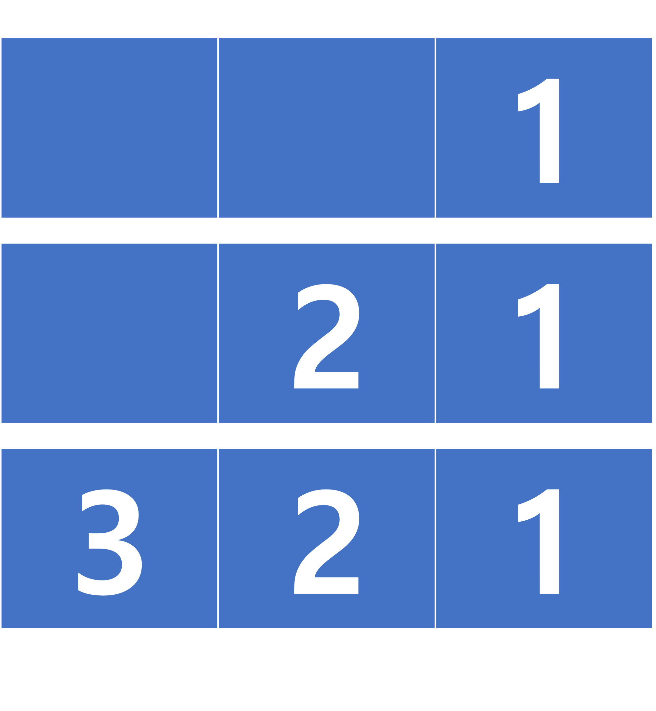

# [자료구조] 2.큐 (Queue)
## 특징
- 줄을 서는 행위와 유사 
- 가장 먼저 넣은 요소를 가장 먼저 꺼낼 수 있는 구조(FIFO,LILO) 
- 장.단점은 크게 존재하지 않으며 멀티 태스킹을 위한 프로세스 스케쥴링 방식을 구현하기 위해 많이 사용됨(운영체제)

- 1,2,3을 큐에 넣었을경우 위와 같은 이미지로 쌓이게 된다.
- 큐에 요소가 하나도 들어있지 않을 때는 공백(empty), 반대로 꽉차면 포화(full)
- Enqueue : 큐 맨 뒤에 어떠한 요소를 추가(rear에 새로운 요소를 추가)
- Dequeue : 큐 맨 앞쪽의 요소를 삭제(front에서 요소를 뺴옴)
- front : 큐의 맨 앞의 위치(인덱스), 가장 먼저 삭제됨
- rear : 큐의 맨 뒤의 위치(인덱스), 가장 최근 삽입됨

## 구현은? 
배열과 링크드리스트로 이용하여 구현할 수 있음, 배열과 링크드리스트는 모두 장단점이 존재하기 때문에 상황에 맞게 사용하면됨