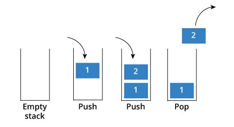

# [자료구조] 3.스택 (Stack)
## 특징

- 데이터를 제한적으로 접근할 수 있는 구조 (한쪽으로만 접근함)
- 가장 나중에 쌓은 데이터를 가장 먼저 뺴낼 수 있는 데이터 구조
- 스택 LIFO , 큐 FIFO

### 대표적인 스택의 활용

- 컴퓨터 내부의 프로세스 구조의 함수 동작 방식
- 웹 브라우저 방문기록 (뒤로가기) : 가장 나중에 열린 페이지부터 다시 보여준다.
- 역순 문자열 만들기 : 가장 나중에 입력된 문자부터 출력한다.
- 후위 표기법 계산

### 주요 기능
- push(): 데이터를 스택에 넣기
- pop(): 데이터를 스택에서 꺼내기
- peek(): 가장 위에 있는 스택을 반환한다.
- isEmpty(): 스택이 비어 있을 때에 true를 반환한다.

- 스택은 단순하고 빠른 성능을 위해 사용되므로, 보통 배열 구조를 활용해서 구현하는 것이 일반적임